## Introduction 
----
This notebook contains Exploratory Data Analysis and Predictive Machine Learning Model for fraud detection. Fraud detection is valuable to many industries including the **banking-financial sectors, insurance, law enforcement, government agencies**, and many more. 

In recent years we have seen a huge increase in Fraud attempts, making fraud detection important as well as challenging. Despite countless efforts and human supervision, **hundreds of millions** are lost due to **fraud**. Fraud can happen using various methods ie, stolen credit cards, misleading accounting, phishing emails, etc. Due to small cases in large population detection of fraud is important as well as challenging.

**Data mining** and **machine learning** help to foresee and **rapidly distinguish fraud** and make **quick move** to limit costs. Using data mining tools, a huge number of transactions can be looked to spot pattern and distinguish fraud transactions.

----


    Data does not have any NULL value.

    step              False
    type              False
    amount            False
    nameOrig          False
    oldbalanceOrg     False
    newbalanceOrg     False
    nameDest          False
    oldbalanceDest    False
    newbalanceDest    False
    isFraud           False
    isFlaggedFraud    False
    dtype: bool


<div>
<table border="1" class="dataframe">
  <thead>
    <tr style="text-align: right;">
      <th></th>
      <th>step</th>
      <th>type</th>
      <th>amount</th>
      <th>nameOrig</th>
      <th>oldbalanceOrg</th>
      <th>newbalanceOrg</th>
      <th>nameDest</th>
      <th>oldbalanceDest</th>
      <th>newbalanceDest</th>
      <th>isFraud</th>
      <th>isFlaggedFraud</th>
    </tr>
  </thead>
  <tbody>
    <tr>
      <th>0</th>
      <td>1</td>
      <td>PAYMENT</td>
      <td>9839.64</td>
      <td>C1231006815</td>
      <td>170136.0</td>
      <td>160296.36</td>
      <td>M1979787155</td>
      <td>0.0</td>
      <td>0.0</td>
      <td>0</td>
      <td>0</td>
    </tr>
    <tr>
      <th>1</th>
      <td>1</td>
      <td>PAYMENT</td>
      <td>1864.28</td>
      <td>C1666544295</td>
      <td>21249.0</td>
      <td>19384.72</td>
      <td>M2044282225</td>
      <td>0.0</td>
      <td>0.0</td>
      <td>0</td>
      <td>0</td>
    </tr>
    <tr>
      <th>2</th>
      <td>1</td>
      <td>TRANSFER</td>
      <td>181.00</td>
      <td>C1305486145</td>
      <td>181.0</td>
      <td>0.00</td>
      <td>C553264065</td>
      <td>0.0</td>
      <td>0.0</td>
      <td>1</td>
      <td>0</td>
    </tr>
    <tr>
      <th>3</th>
      <td>1</td>
      <td>CASH_OUT</td>
      <td>181.00</td>
      <td>C840083671</td>
      <td>181.0</td>
      <td>0.00</td>
      <td>C38997010</td>
      <td>21182.0</td>
      <td>0.0</td>
      <td>1</td>
      <td>0</td>
    </tr>
    <tr>
      <th>4</th>
      <td>1</td>
      <td>PAYMENT</td>
      <td>11668.14</td>
      <td>C2048537720</td>
      <td>41554.0</td>
      <td>29885.86</td>
      <td>M1230701703</td>
      <td>0.0</td>
      <td>0.0</td>
      <td>0</td>
      <td>0</td>
    </tr>
  </tbody>
</table>
</div>


The provided data has the financial transaction data as well as the target variable **isFraud**, which is the actual fraud status of the transaction and **isFlaggedFraud** is the indicator which the simulation is used to flag the transaction using some **threshold value**.

    Minimum value of Amount, Old/New Balance of Origin/Destination:

    amount            0.0
    oldbalanceOrg     0.0
    newbalanceOrg     0.0
    oldbalanceDest    0.0
    newbalanceDest    0.0
    dtype: float64

    Maximum value of Amount, Old/New Balance of Origin/Destination:

    amount            9.244552e+07
    oldbalanceOrg     5.958504e+07
    newbalanceOrg     4.958504e+07
    oldbalanceDest    3.560159e+08
    newbalanceDest    3.561793e+08
    dtype: float64


## Data Analysis

----
Since there is **no missing** and **garbage value**, there is no need for data cleaning, but we still need to perform **data analysis** as data contaion huge variation of the value in different columns. Normalization will also imporve the overall accuracy of the machine learning model.

----


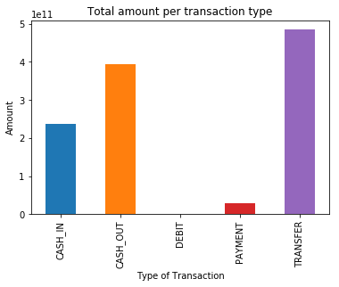

The graph above shows that **TRANSFER** and **CASH_OUT** are two most used mode of transaction and we can see that **TRANSFER** and **CASH_OUT** are also the only way in which fraud happen. **Thus we will focus on this type of transactions**.

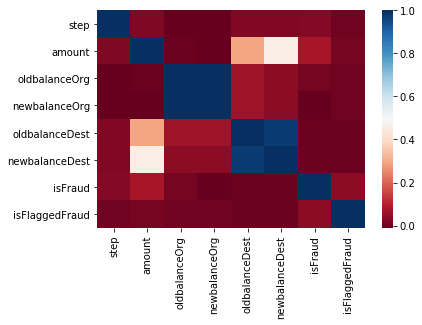


** Things we can conclude from this heatmap: **

* OldbalanceOrg and NewbalanceOrg are highly correlated.
* OldbalanceDest and NewbalanceDest are highly correlated.
* Amount is correlated with isFraud(Target Variable).

There is not much relation between the features, so we need to understand where the relationship between them depends on the type of transaction and amount. To do so, **we need to see the heat map of fraud and nonfraud transactions differently**.


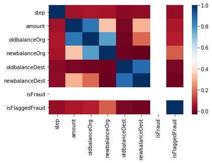


There are 2 flags which stand out to me and it's interesting to look onto: isFraud and isFlaggedFraud column. From the hypothesis, **isFraud** is the indicator which indicates the **actual fraud transactions** whereas **isFlaggedFraud** is what the system prevents the transaction due to **some thresholds** being triggered. From the above heatmap we can see that there is some relation between other columns and isFlaggedFraud thus there must be relation between isFraud.


    The total number of fraud transaction is 8213.
    The total number of fraud transaction which is marked as fraud 16.
    Ratio of fraud transaction vs non-fraud transaction is 1:773.


    Thus in every 773 transaction there is 1 fraud transaction happening.
    Amount lost due to these fraud transaction is $12056415427.

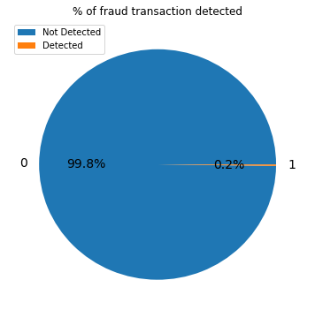


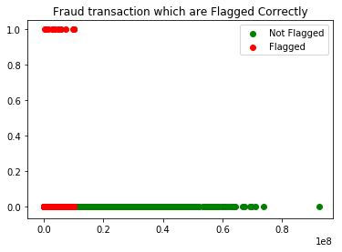


The plot above clearly shows the **need** for a system which can be **fast** and **reliable** to mark the transaction which is fraud. Since, the current system is letting fraud transaction able to **pass through a system** which is **not labeling them as a fraud**. Some data exploration can be helpful to check for the relation between features.

## Data Exploration


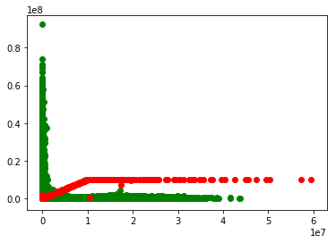


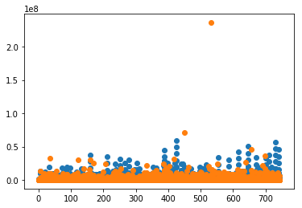


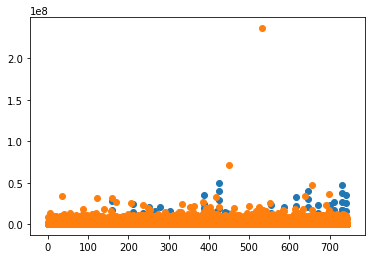


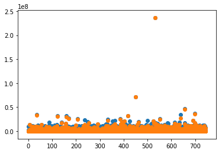


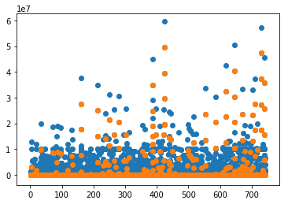


## Data Clearning

<div>
<table border="1" class="dataframe">
  <thead>
    <tr style="text-align: right;">
      <th></th>
      <th>step</th>
      <th>type</th>
      <th>amount</th>
      <th>oldbalanceOrg</th>
      <th>newbalanceOrig</th>
      <th>oldbalanceDest</th>
      <th>newbalanceDest</th>
      <th>isFraud</th>
    </tr>
  </thead>
  <tbody>
    <tr>
      <th>0</th>
      <td>1</td>
      <td>1</td>
      <td>9839.64</td>
      <td>170136.0</td>
      <td>160296.36</td>
      <td>0.0</td>
      <td>0.0</td>
      <td>0</td>
    </tr>
    <tr>
      <th>1</th>
      <td>1</td>
      <td>1</td>
      <td>1864.28</td>
      <td>21249.0</td>
      <td>19384.72</td>
      <td>0.0</td>
      <td>0.0</td>
      <td>0</td>
    </tr>
    <tr>
      <th>2</th>
      <td>1</td>
      <td>2</td>
      <td>181.00</td>
      <td>181.0</td>
      <td>0.00</td>
      <td>0.0</td>
      <td>0.0</td>
      <td>1</td>
    </tr>
    <tr>
      <th>3</th>
      <td>1</td>
      <td>3</td>
      <td>181.00</td>
      <td>181.0</td>
      <td>0.00</td>
      <td>21182.0</td>
      <td>0.0</td>
      <td>1</td>
    </tr>
    <tr>
      <th>4</th>
      <td>1</td>
      <td>1</td>
      <td>11668.14</td>
      <td>41554.0</td>
      <td>29885.86</td>
      <td>0.0</td>
      <td>0.0</td>
      <td>0</td>
    </tr>
  </tbody>
</table>
</div>


## Machine Learning Model


```python
from sklearn.model_selection import train_test_split
train_X, test_X, train_y, test_y = train_test_split(X, y, test_size = 0.2, random_state = 121)
```


```python
from sklearn.ensemble import RandomForestClassifier
clf = RandomForestClassifier(n_estimators=15)
```


```python
probabilities = clf.fit(train_X, train_y.values.ravel()).predict(test_X)
```


```python
from sklearn.metrics import average_precision_score
print(average_precision_score(test_y,probabilities))
```

    0.7687057112224541


## Save the Model


```python
from sklearn.externals import joblib

with open('RandomForestClassifier.pkl','wb') as RandomForestClassifier:
    joblib.dump(clf,RandomForestClassifier)
```

## Check Fraud


```python
example
```


<div>
<table border="1" class="dataframe">
  <thead>
    <tr style="text-align: right;">
      <th></th>
      <th>index</th>
      <th>step</th>
      <th>type</th>
      <th>amount</th>
      <th>oldbalanceOrg</th>
      <th>newbalanceOrig</th>
      <th>oldbalanceDest</th>
      <th>newbalanceDest</th>
      <th>isFraud</th>
    </tr>
  </thead>
  <tbody>
    <tr>
      <th>0</th>
      <td>2</td>
      <td>1</td>
      <td>2</td>
      <td>181.00</td>
      <td>181.0</td>
      <td>0.00</td>
      <td>0.0</td>
      <td>0.0</td>
      <td>1</td>
    </tr>
    <tr>
      <th>1</th>
      <td>3</td>
      <td>1</td>
      <td>3</td>
      <td>181.00</td>
      <td>181.0</td>
      <td>0.00</td>
      <td>21182.0</td>
      <td>0.0</td>
      <td>1</td>
    </tr>
    <tr>
      <th>2</th>
      <td>251</td>
      <td>1</td>
      <td>2</td>
      <td>2806.00</td>
      <td>2806.0</td>
      <td>0.00</td>
      <td>0.0</td>
      <td>0.0</td>
      <td>1</td>
    </tr>
    <tr>
      <th>3</th>
      <td>252</td>
      <td>1</td>
      <td>3</td>
      <td>2806.00</td>
      <td>2806.0</td>
      <td>0.00</td>
      <td>26202.0</td>
      <td>0.0</td>
      <td>1</td>
    </tr>
    <tr>
      <th>4</th>
      <td>680</td>
      <td>1</td>
      <td>2</td>
      <td>20128.00</td>
      <td>20128.0</td>
      <td>0.00</td>
      <td>0.0</td>
      <td>0.0</td>
      <td>1</td>
    </tr>
    <tr>
      <th>5</th>
      <td>0</td>
      <td>1</td>
      <td>1</td>
      <td>9839.64</td>
      <td>170136.0</td>
      <td>160296.36</td>
      <td>0.0</td>
      <td>0.0</td>
      <td>0</td>
    </tr>
    <tr>
      <th>6</th>
      <td>1</td>
      <td>1</td>
      <td>1</td>
      <td>1864.28</td>
      <td>21249.0</td>
      <td>19384.72</td>
      <td>0.0</td>
      <td>0.0</td>
      <td>0</td>
    </tr>
    <tr>
      <th>7</th>
      <td>4</td>
      <td>1</td>
      <td>1</td>
      <td>11668.14</td>
      <td>41554.0</td>
      <td>29885.86</td>
      <td>0.0</td>
      <td>0.0</td>
      <td>0</td>
    </tr>
    <tr>
      <th>8</th>
      <td>5</td>
      <td>1</td>
      <td>1</td>
      <td>7817.71</td>
      <td>53860.0</td>
      <td>46042.29</td>
      <td>0.0</td>
      <td>0.0</td>
      <td>0</td>
    </tr>
    <tr>
      <th>9</th>
      <td>6</td>
      <td>1</td>
      <td>1</td>
      <td>7107.77</td>
      <td>183195.0</td>
      <td>176087.23</td>
      <td>0.0</td>
      <td>0.0</td>
      <td>0</td>
    </tr>
  </tbody>
</table>
</div>


```python
display(form)
```

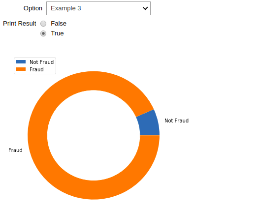

## Conclusion

*  Existing rule-based system is **not capable** of detection of all the fraud transaction.
*  **Machine learning** can be used for the detection of fraud transaction.
*  Predictive models produce **good precision score** and are capable of detection of fraud transaction.
